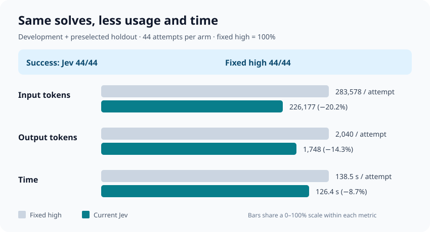
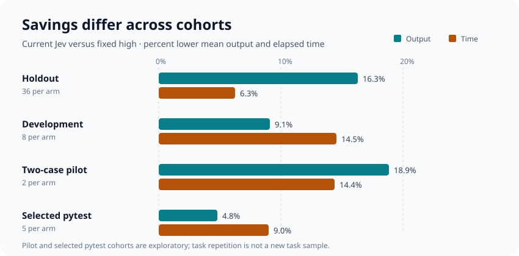

# Jev router: consolidated Astra evaluation

## Bottom line

Across the **44 fresh attempts per arm** in the quota-autoresearch development and preselected holdout cohorts, the **existing Jev prompt** and fixed-high GPT-6 Astra each solved **44/44**. Jev averaged **226,177 input tokens** (including 199,732 cached), **1,748 output tokens**, and **126.4 seconds** per attempt; fixed high averaged **283,578 input** (252,881 cached), **2,040 output**, and **138.5 seconds**. That is **20.2% less input, 14.3% less output, and 8.7% less elapsed time** for Jev on this particular task mix. The holdout alone shows a 16.3% output reduction at 36/36 solves for both arms. These are observed differences, not a general workload saving or a proof of equal solve rates.

The older short/harder pilot and selected hard-case study provide useful context but are exploratory. Including their **seven additional attempts per arm** yields a descriptive **51/51 solves for both arms**, **1,979 versus 2,270 output tokens**, and **136.3 versus 149.8 seconds** per attempt (Jev versus high). That pooled output difference is **12.8%** and time difference **9.0%**. It weights tasks by the number of attempts we happened to run, repeats Flask and pytest #5787 across studies, and is **not** a representative benchmark score. Input for the five older hard-case attempts is unavailable in the published summary, so there is no comparable 51-attempt input average.

Bars compare each metric against its own fixed-high mean (100%); they do not compare input-token counts directly with seconds.

## Cohorts, per-attempt means

| Cohort | Task mix | Arm | Solved / attempts | Valid usage | Input | Cached input | Output | Time (s) |
| --- | --- | --- | ---: | ---: | ---: | ---: | ---: | ---: |
| Preselected holdout | Six distinct SWE-bench issues, six repeats each | Current Jev | 36/36 | 36/36 | 186,492 | 162,677 | 1,507 | 111.0 |
| Preselected holdout | Same | Fixed high | 36/36 | 36/36 | 238,030 | 210,091 | 1,800 | 118.4 |
| Development | Four issues, two repeats each | Current Jev | 8/8 | 8/8 | 404,756 | 366,480 | 2,836 | 195.8 |
| Development | Same | Fixed high | 8/8 | 8/8 | 488,543 | 445,440 | 3,120 | 229.1 |
| **Core combined** | **Holdout + development; 10 issue IDs** | **Current Jev** | **44/44** | **44/44** | **226,177** | **199,732** | **1,748** | **126.4** |
| **Core combined** | **Same** | **Fixed high** | **44/44** | **44/44** | **283,578** | **252,881** | **2,040** | **138.5** |
| Earlier two-case pilot | Flask #5014 and Django #15957, one each | Jev | 2/2 | 2/2 | 262,768 | 232,512 | 2,203 | 148.5 |
| Earlier two-case pilot | Same | Fixed high | 2/2 | 2/2 | 418,384 | 368,704 | 2,715 | 173.5 |
| Selected hard-case study | pytest #5787, five fresh attempts | Jev | 5/5 | 5/5 | — | — | 3,916 | 218.3 |
| Selected hard-case study | Same | Fixed high | 5/5 | 5/5 | — | — | 4,113 | 239.8 |
| **All three studies (descriptive)** | **51 attempts per arm; 11 unique issue IDs** | **Jev** | **51/51** | **51/51 output** | **—** | **—** | **1,979** | **136.3** |
| **All three studies (descriptive)** | **Same** | **Fixed high** | **51/51** | **51/51 output** | **—** | **—** | **2,270** | **149.8** |

Time includes routing and is averaged over all attempts. Tokens include upstream auxiliary requests and are averaged only over evidence-valid attempts; output includes reasoning tokens. Cached input is **part of** input, not additional usage. For the two pilot rows, the source reports whole-second elapsed times; the all-study time averages inherit that rounding. Core aggregates weight each attempt equally and use the source cohort means, so the displayed figures may differ slightly from aggregating raw integer counters. The earlier pilot used the same named model and effort arms but was a separate run; its Flask issue and the hard-case pytest issue also appear in development. The hard-case report publishes output and time, not input.

## What this says about routing

The chart labels attempts **per arm**, not distinct tasks. All the displayed Jev and high attempts passed; pilot and selected pytest results are exploratory.

- The preselected holdout provides the cleanest comparison: equal observed solve counts, with lower tokens and slightly lower time for current Jev. All six issues were solved by every arm on every repeat, so it has little power to identify a quality tradeoff on difficult failures.
- On the selected harder pytest #5787, **medium solved 1/5**, while **Jev, high, and xhigh each solved 5/5**; Jev's mean output/time were below high, and xhigh used 7,029 output tokens and 336.7 seconds. This case was expanded *after* a medium/xhigh difference was observed, so it cannot establish an unbiased general quality advantage.
- In the earlier pilot, Jev beat high on Flask output/time (687 vs 1,430 tokens; 65 vs 126 seconds), but on Django #15957 it used fewer output tokens (3,719 vs 4,000) and took longer (232 vs 221 seconds). Individual agent paths are noisy; a router does not guarantee a saving on every task.
- The newly searched `verify-explicit` prompt is **not included as Jev** in these totals: on the frozen holdout it solved **35/36** versus **36/36** for current Jev, with 1,498 versus 1,507 output tokens on *different valid-usage denominators* and 113.7 versus 111.0 seconds. The search report recommends retaining the current prompt.

## Interpretation and provenance

These are SWE-bench Verified coding-agent attempts, not direct single-call prompt tests. Task labels such as “short” and “harder” describe the study's chosen cases; no calibrated difficulty distribution or real-user mix was sampled. Repeated attempts on an issue are not independent new tasks. The pooled number answers *“what happened across these run schedules?”*; changing the proportion of short and hard cases changes the average. It does not estimate a production-wide percentage or monetary cost (subscription usage and cached tokens have different accounting). No none-effort or xhigh-fixed baseline is part of the 44-attempt core comparison.

Sources: [quota-autoresearch result](quota-autoresearch-2026-09-24.md) (development and holdout, pinned schedule and evidence rules), [two-case pilot](pilot.md), and [selected pytest hard-case study](astra-pytest-5787.md). Only aggregate metadata appears here; raw traces and patches remain in ignored `eval/runs/`.
